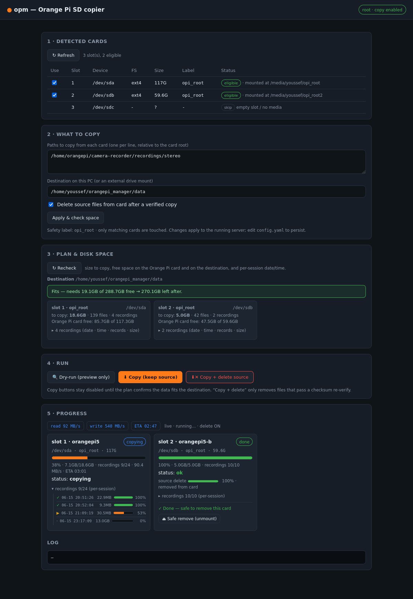
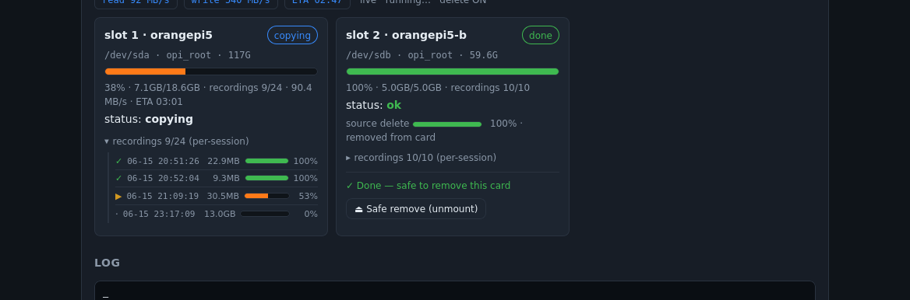

# orangepi_manager (`opm`)

Copy selected files off **Orange Pi OS SD cards** read through a USB card-reader
hub, verify every byte landed, and (optionally) delete the originals from the
card — from a CLI or a local web UI.



---

## Why this exists

Instead of booting each Orange Pi and copying recordings over the network, you
pull the SD card, drop it into a multi-slot USB reader, and `opm` reads the
card's Linux filesystem directly. It is built for a desk with a **4-slot reader
hub** but scales to however many cards are present.

Two things make this more than `mount /dev/sda1 && cp`:

- **Device names aren't stable.** Four readers enumerate as `/dev/sda…sdd` in
  whatever order the kernel sees them, and a multi-slot reader shares one serial
  across its LUNs. `opm` identifies a physical slot by its **USB topology**
  (`/dev/disk/by-path`), not by device name or serial.
- **Cards can be "dirty."** A Pi powered off uncleanly leaves a dirty ext4
  journal; a normal mount would *write* to the card. `opm` reads with
  `ro,noload` + `blockdev --setro` so the copy phase never writes a byte. If the
  desktop already auto-mounted the card at `/media`, `opm` reuses that mount
  instead of fighting it.

---

## Features

- **Detection** — finds USB SD readers, picks the ext4 root, and only treats a
  card as an Orange Pi if its filesystem **label matches `opi_root`** (a safety
  gate so it never touches an unrelated USB drive).
- **Pre-copy plan & disk-space check** — shows how much each card holds, free
  space on the **card** and the **destination**, and a *fits / won't-fit*
  verdict. The copy is refused if it won't fit.
- **Per-recording breakdown** — each session folder (`YYYYMMDD-HHMMSS`) is shown
  as a readable date + time with its record types (`stereo×1, imu×1, …`) and size.
- **Live progress** — per-card progress bar, bytes copied/total, recordings
  done/remaining, **copy rate (MB/s)**, **per-card ETA**, an **overall job ETA**,
  live **read/write speed** (from `/proc/diskstats`), and a per-recording list
  with its own mini progress bars.
- **Verified, safe deletion** — three independent gates (see *Safety* below)
  before any source file is removed.
- **Safe-remove** — when a card finishes, a one-click **⏏ unmount** so you can
  pull it.



---

## Requirements

A Linux PC (developed on Ubuntu 22.04) with: `rsync`, `e2fsprogs` (`e2fsck`),
`util-linux` (`blockdev`, `lsblk`, `findmnt`, `umount`), `python3` + `PyYAML`.
Mounting needs root, so the copy commands run under `sudo`.

```bash
sudo apt install rsync e2fsprogs util-linux python3-yaml
```

---

## Quick start

### Web UI (recommended)

```bash
cd orangepi_manager
sudo python3 webui.py          # root is needed to mount cards
```

Open **http://127.0.0.1:8765** (bound to localhost only — it runs as root and
can delete, so it must not be network-exposed). Then:

1. **Refresh** detection and tick the slots you want.
2. Set the **paths to copy** and the **destination**, click *Apply & check space*.
3. Check the **Plan & disk space** panel is green.
4. **🔍 Dry-run** (read-only preview) → **⬇ Copy (keep source)** → when happy,
   **⬇✕ Copy + delete source** (asks to confirm).
5. When a card shows **✓ Done**, click **⏏ Safe remove** and pull it.

### CLI

```bash
python3 opm.py detect              # list detected cards (no root)
sudo python3 opm.py run --dry-run  # mount read-only, preview what would copy
sudo python3 opm.py run --no-delete# real copy + checksum verify, keep source
sudo python3 opm.py run            # copy + verify + delete (prompts y/N first)
```

---

## Configuration (`config.yaml`)

| key | meaning |
|---|---|
| `destination` | where copies land: `<dest>/<card-id>/<timestamp>/…` |
| `copy_paths` | **the files/dirs to pull off each card** (relative to the card root) |
| `exclude` | rsync exclude patterns (never copied, never deleted) |
| `copy.flatten` | `true`: copy only the leaf dir (`dest/stereo/…`); `false`: full on-card path |
| `copy.parallel` / `max_workers` | process cards concurrently |
| `safety.require_label` | ext label that marks a genuine Orange Pi card (`opi_root`); `null` disables the guard |
| `safety.min_size_gb` | ignore devices smaller than this (filters empty reader slots) |
| `identify.mode` | per-card folder naming: `both` / `content` / `slot` |
| `identify.marker_file` | optional file on the Pi for a custom card id |
| `after_copy.verify` | checksum-verify every copied file before any deletion |
| `after_copy.delete_source` | remove verified files from the card |
| `after_copy.prune_empty_dirs` | remove dirs left empty by deletion (never the leaf) |
| `mount.fsck_dirty` | run `e2fsck -p` before the writable delete phase |
| `require_confirm` | CLI prompts y/N before the delete phase |

Editing `copy_paths` / `destination` / `delete_source` in the web UI applies to
the running server only; edit `config.yaml` to persist.

---

## How it works

Per-card pipeline (`opm.process_card`):

```
detect → mount READ-ONLY (or reuse the desktop /media mount) → identify
       → copy (rsync) → verify (rsync -c) → delete source → unmount
```

- **detect** — `lsblk` for USB disks, `/dev/disk/by-path` for stable slot order,
  the largest `ext*` partition is the root, label must match `safety.require_label`.
- **identify** — names the destination folder from `/etc/hostname` /
  `/etc/machine-id` / a marker file, falling back to the physical slot, with
  cross-card de-duplication for cloned images.
- **copy** — `rsync -aHAX`; `flatten` controls whether the full on-card path or
  just the leaf folder is recreated.
- **verify / delete** — see *Safety*.

The web server (`webui.py`, stdlib `http.server`) runs a copy as a background
job and the page polls `/api/status`; a sampler thread updates speeds, progress,
ETAs and delete progress twice a second.

---

## Safety

The read phase mounts `ro,noload` + `blockdev --setro` — **no writes to the card
during copy**. Deletion only ever happens behind **three independent gates**:

1. **`verify()`** — an `rsync -c` checksum dry-run; any mismatch aborts the
   delete and keeps the source.
2. **`missing_on_dest()`** — confirms every source file is present on the
   destination (size + mtime, respecting excludes); aborts if any is missing.
3. **`rsync -aHAXc --remove-source-files`** — re-checksums each file and, if the
   destination differs, re-copies it *before* removing the source — so a correct
   copy always exists on the PC before the original is touched.

Deletion never removes directories (only files); `prune_empty_dirs` then removes
*empty* session folders but never the leaf, so excluded files keep their folder.
Output is `chown`ed back to the invoking (sudo) user.

---

## Testing

```bash
python3 -m unittest test_opm -v
```

`test_opm.py` covers the engine with synthetic directories (no root, no real
cards): stats/session parsing, disk-free, the flatten copy layout, checksum
verify, the pre-delete guard (incl. excludes and size mismatches), that deletion
keeps excluded files and aborts when anything is missing, and card identification
with clone de-duplication.

---

## Project layout

```
orangepi_manager/
├── opm.py            # engine + CLI (detect, run)
├── webui.py          # local web server (stdlib http.server) over the same engine
├── web/index.html    # single-page UI (vanilla JS, no build step)
├── config.yaml       # what to copy, destination, safety, identify, flatten
├── test_opm.py       # unittest suite
├── docs/             # screenshots + demo page used to generate them
└── data/             # default destination root
```

---

## Troubleshooting

- **`run` says it needs root** — mounting requires it: `sudo python3 webui.py`
  (or `sudo python3 opm.py run`). `detect` works without root.
- **`/media/.../home` shows a padlock** — that's a *permissions* emblem (`/home`
  is root-owned and not writable by you), **not** encryption. The data is plain
  ext4 and readable.
- **"already mounted on /media/…"** — fixed: `opm` now reuses the desktop's
  auto-mount. If you want the strict read-only guarantee back, stop the desktop
  from auto-mounting `opi_root`.
- **Won't fit** — the destination is too small; free space or point the
  destination at an external drive. (The PC's system disk is usually too small
  to hold several full cards — use external storage for the real workflow.)
- **Port 8765 already in use** — a previous `webui.py` is still running.
